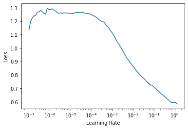

# fastai_object_detection
> Extension for <a href='https://docs.fast.ai'>fastai</a> library to include object recognition.


## Install

`pip install --upgrade git+https://github.com/rbrtwlz/fastai_object_detection`

## Usage

This package makes object detection and instance segmentation models available for fastai users by using 
a callback which converts the batches to the required input. 

It comes with a fastai `DataLoader`s class for object detection, prepared and easy to use models and 
some metrics to measure generated bounding boxes (mAP). So you can train a model for object detection 
in the simple fastai way with one of the included `Learner` classes.


All you need is a pandas `DataFrame` containing the data for each object in the images. In default setting follwing columns are required:

For the image, which contains the object(s):

* `image_id`
* `image_path`

The object's bounding box:

* `x_min`
* `y_min`
* `x_max`
* `y_max`

The object's class/label:

* `class_name`

If you want to use a model for instance segementation, following columns are additionally required:

* `mask_path` (path to the binary mask, which represents the object in the image)

There are helper functions available, for example for adding the `image_path` by `image_id` or to change the bbox format from `xywh` to `x1y1x2y2`.

Futhermore there is a `CocoData` class provided to help you to download images from [Microsoft COCO dataset](https://cocodataset.org/#home), create the corresponding masks and generate a `DataFrame`.

Microsoft COCO dataset contains **328,000 annotated images** of **91 object categories**, so you can pick the categories you want and download just associated images.

Simply use the following line for example to create a dataset for cat and dog detection:


```python
from fastai.vision.all import *
from fastai_object_detection.all import *

path, df = CocoData.create(ds_name="coco-cats-and-dogs", cat_list=["cat", "dog"], 
                           max_images=2000, with_mask=False)
```

Then you can build `DataLoader`s, using it's `from_df` factory method.

```python
dls = ObjectDetectionDataLoaders.from_df(df, bs=2, 
                                         item_tfms=[Resize(800, method="pad", pad_mode="zeros")], 
                                         batch_tfms=[Normalize.from_stats(*imagenet_stats)])
dls.show_batch()
```

Now you are ready to create your `fasterrcnn_learner` to train a [FasterRCNN](https://arxiv.org/abs/1506.01497) model (with resnet50 backbone). To validate your models predictions you can use metrics like `mAP_at_IoU60`.

```python
learn = fasterrcnn_learner(dls, fasterrcnn_resnet50, 
                           opt_func=SGD, lr=0.005, wd=0.0005, train_bn=False,
                           metrics=[mAP_at_IoU40, mAP_at_IoU60])
learn.lr_find()
learn.fit_one_cycle(10, 1e-04)
```

## Tutorial


First import the libraries.

```
from fastai.vision.all import *
from fastai_object_detection.all import *
```

Then you can donwload images of the categories you want to detect. If you want to train a instance segmentation model use `with_mask=True`.

```
path, df = CocoData.create(ds_name="ds-cats-dogs", cat_list=["cat", "dog"], max_images=500)
```

    Creating folders.
    Downloading annotation files...
    loading annotations into memory...
    Done (t=18.32s)
    creating index...
    index created!
    Found 2 valid categories.
    ['cat', 'dog']
    Starting download.


    Downloading images of category cat
    Downloading images of category dog
    974 images downloaded.
    Creating Dataframe...


<div>
    <style>
        /* Turns off some styling */
        progress {
            /* gets rid of default border in Firefox and Opera. */
            border: none;
            /* Needs to be in here for Safari polyfill so background images work as expected. */
            background-size: auto;
        }
        .progress-bar-interrupted, .progress-bar-interrupted::-webkit-progress-bar {
            background: #F44336;
        }
    </style>
  <progress value='974' class='' max='974' style='width:300px; height:20px; vertical-align: middle;'></progress>
  100.00% [974/974 00:02<00:00]
</div>


After the images were downloaded, you can create `DataLoaders` with the `from_df` factory method and show some batches. If the column `mask_path` is present in your `DataFrame`, it creates a `DataLoader` for instance segmentation (images, bounding boxes, labels and masks) otherwise for object detection (images, bounding boxes and labels)

```
dls = ObjectDetectionDataLoaders.from_df(df, bs=2, 
                                         item_tfms=[Resize(800, method="pad", pad_mode="zeros")], 
                                         batch_tfms=[Normalize.from_stats(*imagenet_stats)])
```

```
dls.show_batch(figsize=(10,10))
```


Then you can choose which architectur you want to use. 

Create a learner and pass a model like `fasterrcnn_resnet50` together with `dls`.

In my experiments it was easier to train using `SGD` as optimizer rather then `Adam`. Finally you need metrics to measure the predictions of your model. For bounding boxes the metric "mean average precision" at different IoUs (Intersection over Union) is common.

```
learn = fasterrcnn_learner(dls, fasterrcnn_resnet50, 
                           opt_func=SGD, lr=0.005, wd=0.0005, train_bn=False,
                           metrics=[mAP_at_IoU40, mAP_at_IoU60])
learn.freeze()
```

    Downloading: "https://download.pytorch.org/models/resnet50-19c8e357.pth" to /root/.cache/torch/hub/checkpoints/resnet50-19c8e357.pth


    


    Downloading: "https://download.pytorch.org/models/fasterrcnn_resnet50_fpn_coco-258fb6c6.pth" to /root/.cache/torch/hub/checkpoints/fasterrcnn_resnet50_fpn_coco-258fb6c6.pth


    


After freezing the `Learner` you can search for a learning rate using fastai's `LRFinder`.

```
learn.lr_find()
```


    SuggestedLRs(lr_min=0.13182567358016967, lr_steep=0.0012022644514217973)





```
learn.fit_one_cycle(3, 1.2e-03)
```


<table border="1" class="dataframe">
  <thead>
    <tr style="text-align: left;">
      <th>epoch</th>
      <th>train_loss</th>
      <th>valid_loss</th>
      <th>mAP@IoU>0.4</th>
      <th>mAP@IoU>0.6</th>
      <th>time</th>
    </tr>
  </thead>
  <tbody>
    <tr>
      <td>0</td>
      <td>0.215825</td>
      <td>0.222323</td>
      <td>0.266165</td>
      <td>0.159613</td>
      <td>02:11</td>
    </tr>
    <tr>
      <td>1</td>
      <td>0.228564</td>
      <td>0.229215</td>
      <td>0.575760</td>
      <td>0.475490</td>
      <td>02:13</td>
    </tr>
    <tr>
      <td>2</td>
      <td>0.221335</td>
      <td>0.225777</td>
      <td>0.592301</td>
      <td>0.496557</td>
      <td>02:12</td>
    </tr>
  </tbody>
</table>


After a couple of epochs you can unfreeze the `Learner` and train the whole model for some extra epochs.

```
learn.unfreeze()
```

```
learn.fit_one_cycle(3, 1.2e-03)
```


<table border="1" class="dataframe">
  <thead>
    <tr style="text-align: left;">
      <th>epoch</th>
      <th>train_loss</th>
      <th>valid_loss</th>
      <th>mAP@IoU>0.4</th>
      <th>mAP@IoU>0.6</th>
      <th>time</th>
    </tr>
  </thead>
  <tbody>
    <tr>
      <td>0</td>
      <td>0.217540</td>
      <td>0.214623</td>
      <td>0.644282</td>
      <td>0.572567</td>
      <td>03:47</td>
    </tr>
    <tr>
      <td>1</td>
      <td>0.188819</td>
      <td>0.209889</td>
      <td>0.673792</td>
      <td>0.622807</td>
      <td>03:46</td>
    </tr>
    <tr>
      <td>2</td>
      <td>0.189735</td>
      <td>0.208002</td>
      <td>0.680001</td>
      <td>0.630279</td>
      <td>03:45</td>
    </tr>
  </tbody>
</table>

